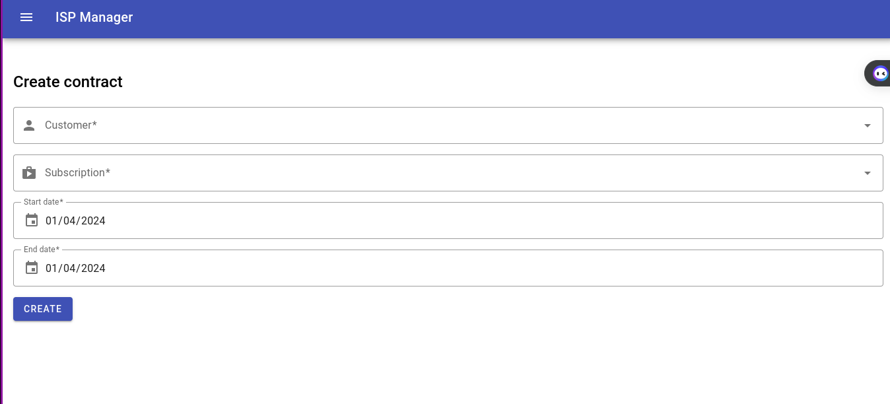

# ISP Manager

Internet Service Provider bill manager implemented using Rust fullstack (Yew and Warp) and Oracledb.


## Prerequisites and Setup

Install [Trunk](https://trunkrs.dev/#install), [Rust](https://www.rust-lang.org/tools/install) and [Docker](https://docs.docker.com/get-docker/).

### Database (Docker)

To run [OracleDB](https://www.oracle.com/database/) using [docker-compose](https://hub.docker.com/r/oracledb19c/oracle.19.3.0-ee), run:

- `docker-compose up`, press `Ctrl + C` to quit
- `docker-compose up -d` to run in detached mode, and
  run `docker-compose down` when done

### Backend

Go to `./backend` and start the server using `make dev`.

### Frontend

Go to `./frontend` and start a local server on port 8080 using `make web`.

You can visit the frontend by going to http://127.0.0.1:8080.

## Infrastructure

The db connection is fostered using [Rust-oracle](https://crates.io/crates/oracle) - a safe Oracle driver for the Rust programming language and
[R2d2-oracle](https://crates.io/crates/r2d2-oracle) - a connection pool for Oracle using Rust r2d2 pool manager.

The [Rust-oracle](https://crates.io/crates/oracle) driver is built on top of the [ODPI-C](https://oracle.github.io/odpi/) library which is a wrapper around 
the [OCI](https://www.oracle.com/database/technologies/appdev/oci.html) API - the comprehensive, high performance, native C language interface to Oracle Database for custom or packaged applications.

Upon launching the server, the database connection pool is initialized and the database schema is created if it doesn't exist using the predefined SQL scripts from the `./backend/db-scripts` folder.

```rust
pub async fn get_db_con(db_pool: &DBPool) -> Result<DBCon> {
    db_pool.get().map_err(Error::DBPool)
}

pub fn create_pool() -> std::result::Result<DBPool, oracle::Error> {
    let config = CONFIG.clone();
    let manager = OracleConnectionManager::new(
        config.db_user.as_str(),
        config.db_pass.as_str(),
        config.db_dsn.as_str(),
    );

    Ok(r2d2::Pool::builder()
        .max_size(DB_POOL_MAX_OPEN)
        .build(manager)
        .expect("database pool can be created"))
}
```

Then a db connection retrieved from the pool is passed to each warp endpoint handler and its associated repository.
Each repository is responsible for executing the SQL queries related to its handler business logic against the DB 
and returning the results back to the handler. 

An example of repository method is the following:

```rust
// fetch all the customers from the database

pub const TABLE: &str = "customer";
pub const SELECT_FIELDS: &str = "id, name, fullname, address, phone, cnp";

pub async fn fetch(db_pool: &DBPool) -> Result<Vec<Customer>> {
  let con = get_db_con(db_pool).await?;
  let query = format!("SELECT {} FROM {}", SELECT_FIELDS, TABLE);

  let rows = con.query(query.as_str(), &[]).map_err(Error::DBQuery)?;

  Ok(rows
          .filter(|r| r.is_ok())
          .map(|r| row_to_customer(&r.unwrap()))
          .collect())
}
```

### Database Schema and ERD

There are a few tables in the database that are used to model the ISP related domain, including:

- `customer` - stores customer information:
    - `id` - customer id (_number primary key_)
    - `name` - customer name (_nvarchar2_)
    - `fullname` - customer full name (_nvarchar2_)
    - `address` - customer address (_nvarchar2_)
    - `phone` - customer phone number (_nvarchar2_)
      - `constraint regexp_like(phone, '^[0-9]{10,12}$'))`
    - `cnp` - customer CNP (_nvarchar2_)
        - `constraint regexp_like(cnp, '^[0-9]{13}$'))`
- `subscription` - stores subscription information
    - `id` - subscription id (_primary key_)
    - `description` - subscription description (_nvarchar2_)
    - `type` - subscription type (_nvarchar2_)
      - `constraint type in ('MOBILE', 'FIXED', 'TV', 'MOBILE_INTERNET', 'FIXED_INTERNET')`
    - `traffic` - subscription traffic (_number_)
      - `constraint traffic > 0`
    - `price` - subscription price (_number_)
        - `constraint price > 0`
    - `extra_traffic_price` - subscription extra traffic price (_number_)
        - `constraint extra_traffic_price > 0`
- `contract` - stores contract information
    - `id` - contract id (_primary key_)
    - `customer_id` - contract customer id (_foreign key_)
    - `subscription_id` - contract subscription id (_foreign key_)
    - `start_date` - contract start date (_date_)
    - `end_date` - contract end date (_date_)
    - `constraint start_date < end_date`
- `invoice` - stores invoice information
    - `id` - invoice id (_primary key_)
    - `contract_id` - invoice contract id (_foreign key_)
    - `issue_date` - invoice issue date (_date_)
    - `due_date` - invoice due date (_date_)
    - `amount` - invoice amount (_number_)
        - `constraint amount > 0`
    - `status` - invoice status (_nvarchar2_)
        - `constraint status in ('PAID', 'UNPAID')`
- `payment` - stores payment information
    - `id` - payment id (_primary key_)
    - `invoice_id` - payment invoice id (_foreign key_)
    - `payment_date` - payment date (_date_)
    - `amount` - payment amount (_number_)
        - `constraint amount > 0`

Relationships between tables:

- a customer can have multiple contracts
- a contract can have multiple invoices
- an invoice can have multiple payments
- a contract can have only one subscription
- a subscription can be used in multiple contracts
- a contract can have only one customer


### Database Stored Procedures and Triggers

There are a few stored procedures and triggers that are used to model the ISP related domain, including:

- `get_unpaid_invoices` - returns all unpaid invoices for a given customer
- `get_contracts` - returns all contracts for a given customer
- `get_invoices` - returns all invoices for a given contract
- `get_payments` - returns all payments for a given invoice
- `update_invoice_amount` - updates the invoice amount when a subscription price is updated
- `update_invoice_status` - updates the invoice status when a payment is made

## Backend

The backend is implemented using [Warp](https://crates.io/crates/warp) - a super-easy, composable, Rust web server framework for warp speeds.

The Warp framework:

- is one of the most low-level web frameworks in Rust.
- is oriented around the concept of filters.
- builds on top of the [hyper](https://crates.io/crates/hyper) HTTP library.
- provides out of the box:
  - Path routing and parameter extraction
  - Header requirements and extraction
  - Query string deserialization
  - JSON and Form bodies
  - Multipart form data
  - Static Files and Directories
  - Websockets
  - Access logging
  - Gzip, Deflate, and Brotli compression

Basic warp setup:

```rust
// fetch all the customers from the database route handler
pub async fn fetch(db_pool: DBPool) -> Result<impl warp::Reply, warp::Rejection> {
    let customers = customer_repo::fetch(&db_pool).await.map_err(Error::DBQuery)?;

    Ok(warp::reply::json(&customers))
}

// fetch all the customers from the database route
pub fn fetch_route(db_pool: DBPool) -> impl Filter<Extract = impl warp::Reply, Error = warp::Rejection> + Clone {
    warp::path!("customers")
        .and(warp::get())
        .and(with_db(db_pool))
        .and_then(fetch)
}

// server entry point
#[tokio::main]
async fn main() {
    let db_pool = db::create_pool().expect("database pool can be created");

    let routes = fetch_route(db_pool.clone());

    warp::serve(routes).run(([127, 0, 0, 1], 3030)).await;
}
```

### API Endpoints

| Name                   | Image                                                                  |
|------------------------|------------------------------------------------------------------------|
| Customer Endpoints     |          |
| Subscription Endpoints |  |
| Contract Endpoints     |          |
| Invoice Endpoints      |            |
| Payment Endpoints      |            |

## Frontend

The frontend is implemented using [Yew](https://yew.rs) - a React like framework powered by Rust and WebAssembly.

The Yew framework:

- is a modern Rust framework inspired by Elm and ReactJS for creating multi-threaded frontend apps with WebAssembly.
- supports JSX, Rust Macros, and WebAssembly.
- is designed to be an alternative to ReactJS for Rust and targets Wasm.
- supports both functional and component-based development as ReactJS does.

### Components

Each page is implemented as a class component that implements the `Component` trait's lifecycle methods:

```rust
#[derive(Properties, Clone)]
pub struct PageProps;

pub struct Page;

pub enum Msg {}

impl Component for Page {
    // event type dispatched by the component
    type Message = Msg;
    // props passed to the component by the parent component
    type Properties = PageProps;

    // init the component state
    fn create(ctx: &Context<Self>) -> Self {
        Self {}
    }

    // update the component state according to the message received
    // in a reactive manner
    fn update(&mut self, ctx: &Context<Self>, msg: Self::Message) -> bool {
        false
    }

    // render the component view
    fn view(&self) -> Html {
        html! {
            <div class="page">
                <div class="page-header">
                    <h1>{ "Page" }</h1>
                </div>
                <div class="page-content">
                    { "Page content" }
                </div>
            </div>
        }
    }
}
```

- `Home`


- `Subscriptions list`


- `Subscription details`


- `Subscription create`


- `Subscription edit`


- `Customers list`


- `Customer details`


- `Customer create`


- `Customer edit`


- `Contract details`


- `Contract create`



- `Contract edit`


- `Invoice details`


- `Invoice create`


- `Payment create`

